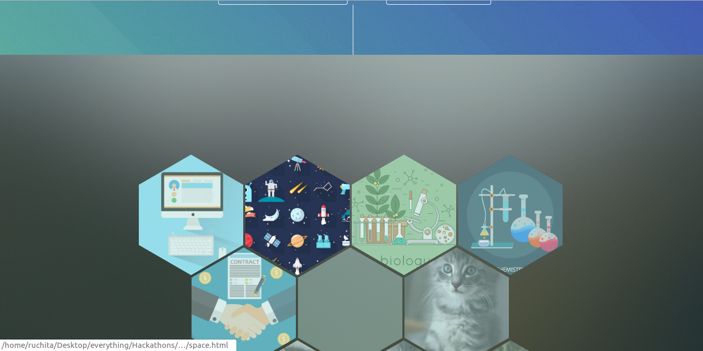

# Ms.Know-it-all

Ms.Know-it-all is a creative platform
for the public and scientists in any field of study to learn the definitions of jargons using the power of crowdsourcing. Anybody can learn new things, post doubts or questions and answer someone else's posts.

# Features

- Users can sign up or sign in and use the portal for one of the following purposes: 
	- Add a new jargon with its meaning. 
	- Look up a jargon term using the search bar. Users can enter 'computer-science' or 'business' or 'None' or 'False' in the Domain input field.
	- If domain is entered, along with the meaning of the jargon, the application also displays MOOCs relevant to that term.
	- Click on the upload document option and upload a pdf file. The application scans the document and displays its content along with the meanings of all the jargons present in that document. 
	
### Screenshots

Login Page 

Home Page 

Astronomy Section

